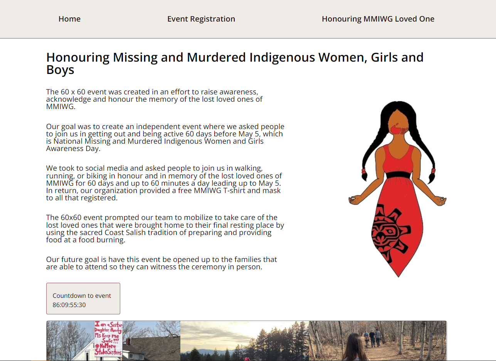
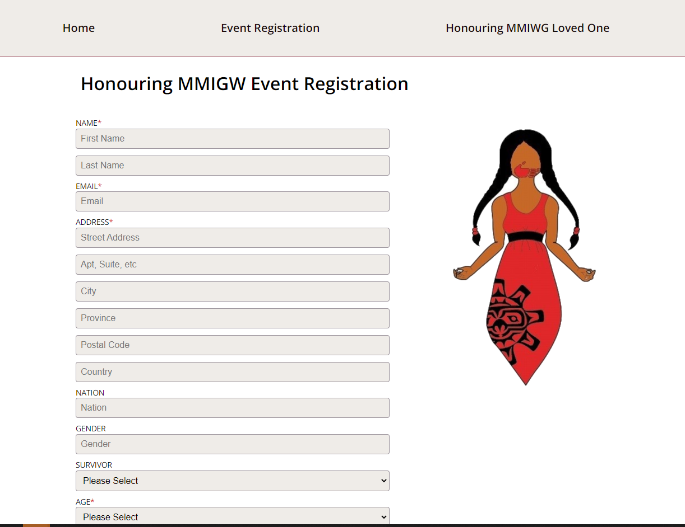
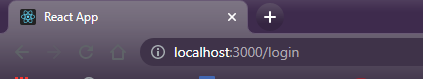
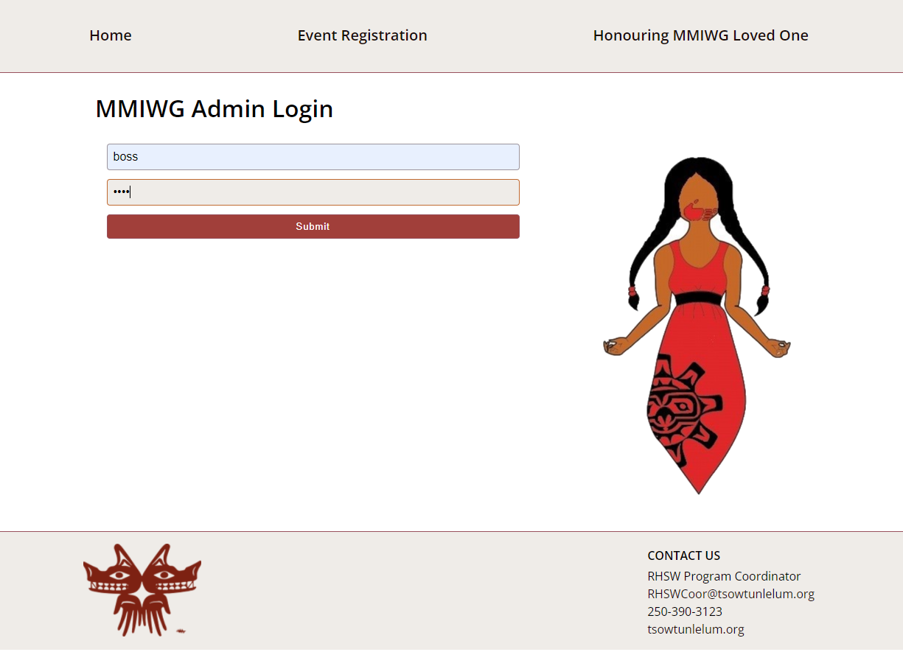
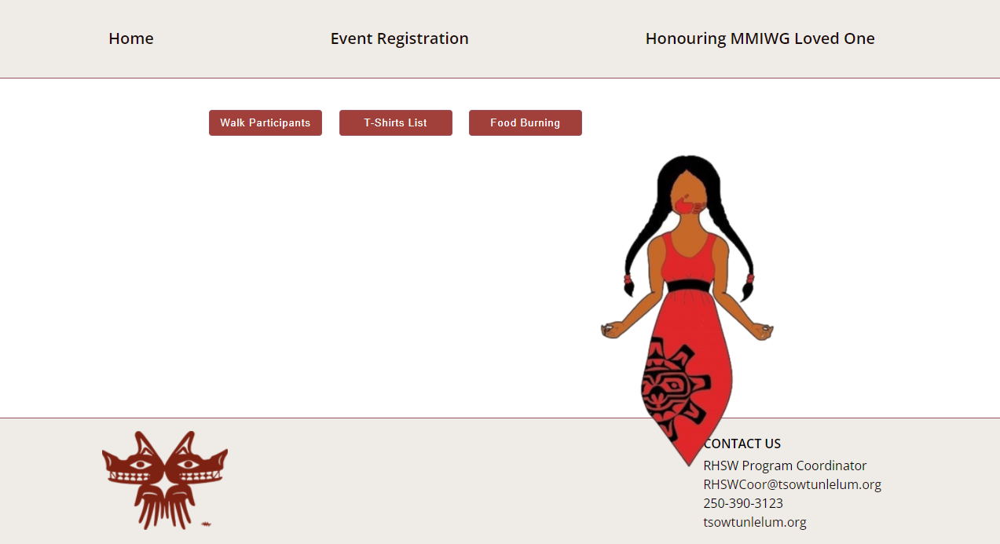
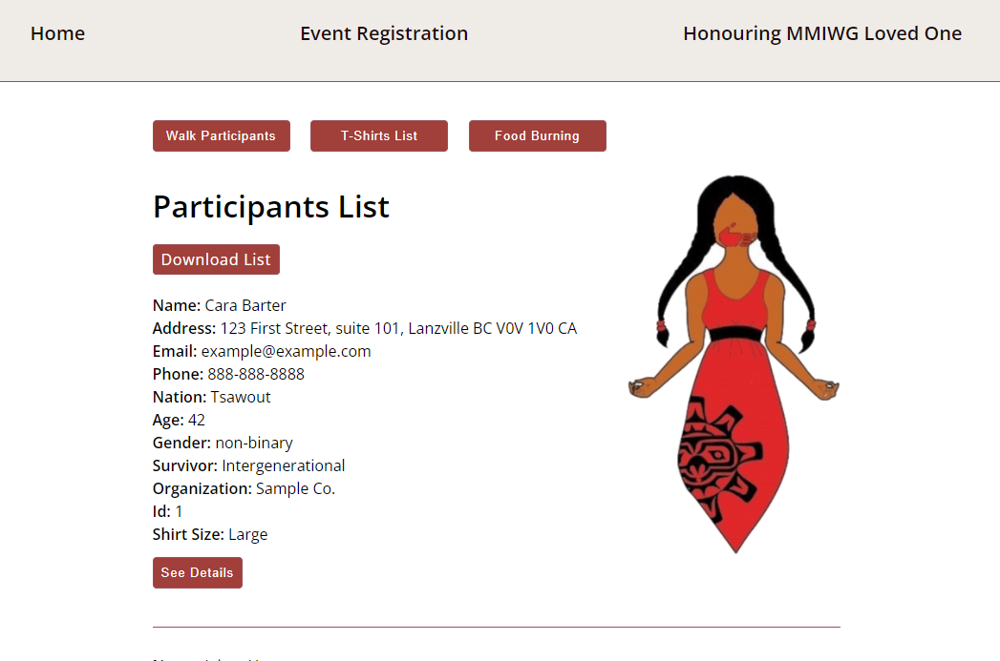
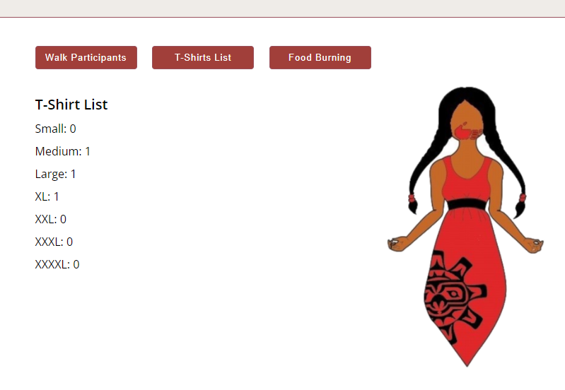

# Honouring Missing and Murdered Indigenous Women Girls and Boys Event Registration

Fully responsive for mobile, tablet and desktop. I made this web application to handle registrations for Tsow Tun Lelum Healing House's events to honour Missing and Murdered Indigenous Women Girls and boys. On the public facing, client side, there is a homepage, and two seperate registration forms. 

There is also a hidden admin section that staff will need to login to access. There, they can access registrations and information that they will need to manage the event.
The server connects to a mySQL database that stores participant info, ceremony honouree info and admin info.

## Creator info

Creator: Cara Barter

Email: carabarter@gmail.com

GitHub: https://github.com/Cara-Barter

LinkedIn: https://www.linkedin.com/in/cara-barter/

## Acknowledgement

The land where I currently work and play is unceded homelands of the Coast Salish Peoples. 

I'd like to thank **First Nations Tech Council** for the support they have provided me in my educational journey over the past year.  My educational team at **BrainStation** has been instrumental in my learning. I highly recommend their bootcamp program.

I'd also like to thank **Tsow Tun Lelum Society** for the excellent work that they do supporting Indigenous communities.  It was an honour to support the work that you do.

## Installation

**In the project directory, run:**

### in `client` folder

#### `npm install` 
installs dependencies.

#### `npm start`
will run the project in developer mode.
Open [http://localhost:3000](http://localhost:3000) to view in the browser. 

### in `server` folder

#### `npm install`
installs dependencies.

create a **mysql** database schema named `mmiwg`.
set up your **knexfile.js** with your username and password. 

see **.env.example** to set up a .env file.

#### `npm run migrate`
will create tables in your database.

#### `npm run seed`
will create seed data in your tables. 

#### `npm start`
will start the server on port 5000.

## Features

Homepage features information about the event, the art that the site was designed around, a countdown timer using react-countdown, and a picture collage that I designed with CSS.

Each registration page uses form validation with all of the required fields outlined by the client.

As I didn't want the admin side to be visible to the public, the login page can only be accessed by typing 'login' into the browser.

To access the sample data, type in the username 'boss' and password 'test'.

Options on the admin page include access to each registration list, as well as get details on the t-shirts they will need to order.

On the 'walk participants' list, they can download a csv mailing list to send put registration packages. They can also see details of each participant. The 'food burning' list is also downloadable so they can print it to use in the ceremony.

'T-shirts List' gives them a compiled list of how many t-shirts they will need to order in each size.

## Tech Stack

### [React](https://reactjs.org/)
Client side created with `create-react-app`.

### [SASS](https://sass-lang.com/)
Styled client side using BEM principles.

### [Axios](https://axios-http.com/)
How the client side communicates with the server side.

### [React-countdown](https://www.npmjs.com/package/react-countdown)
customizable countdown component for react.

### [CSV.js](https://csv.js.org)
Used to download printable lists.

### [Node.js](https://nodejs.org/en/)
Runs server side.

### [Express](http://expressjs.com/)
Used to communicate on server side.

### [Knex](http://knexjs.org//)
Used to communicate with mySQL.

### [mySQL](https://www.mysql.com/)
Stores participant and admin data. Note that there are multiple tables, two that handle event registrations, one for honouring ceremony and one for admin users.

### [JWT](https://jwt.io/)
Used for admin auth to access database information.

## Roadmap

In future, I will be deploying this. My plan is to seperate the client and server sides and deploy server with Heroku and client with Netlify.

## Support

If you have questions or comments or would like to contribute to the project, please feel free to contact me at the links above. If you like the project and want to see more Indigenous content on the web, please show some love and give it a star. :star: